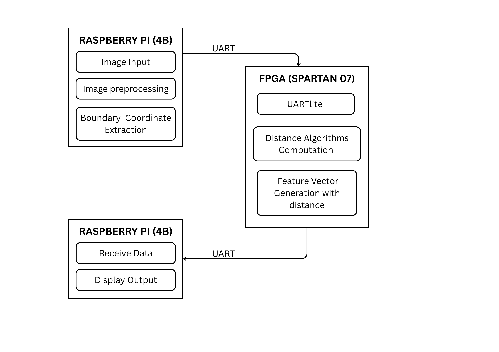

# Hardware--Software Co-Design for Shape Feature Extraction

A hardware--software co-design system for **boundary-based shape feature
extraction**, combining Raspberry Pi image processing with **Spartan-7
FPGA-based computation**. The system extracts ordered boundary
coordinates from binary images and transfers coordinate data to the
FPGA, where a MicroBlaze processor and custom AXI4-Lite IP perform
directional and distance-based feature computation.

The project demonstrates a hardware--software partitioning approach in
which image processing is performed on the Raspberry Pi while
computational feature extraction is implemented on the FPGA.

------------------------------------------------------------------------

## Overview

The system processes an input image through the following stages:

1.  Image loading and resizing to `256 × 256`.
2.  Grayscale conversion.
3.  Binary image generation using thresholding.
4.  External contour detection using OpenCV.
5.  Extraction of ordered boundary coordinates.
6.  Formation of consecutive coordinate pairs.
7.  Transfer of coordinate data to the FPGA through UART.
8.  Computation of coordinate differences and directional movement.
9.  Computation of multiple distance metrics using the FPGA-based
    feature extraction IP.

------------------------------------------------------------------------


## System Block Diagram

The system follows a hardware–software co-design approach in which the Raspberry Pi 4B performs image preprocessing and boundary-coordinate extraction, while the Spartan-7 FPGA performs directional and distance-based feature computation. UART is used for data transfer between the Raspberry Pi and FPGA, with a MicroBlaze processor interfacing with the custom AXI4-Lite feature-computation IP.



------------------------------------------------------------------------

## Hardware

-   **Raspberry Pi 4B** -- image preprocessing and boundary-coordinate
    extraction
-   **Spartan-7 FPGA board** -- hardware-based feature computation
-   **MicroBlaze processor** -- embedded processing within the FPGA
    design
-   **Custom AXI4-Lite IP** -- memory-mapped coordinate and distance
    computation
-   **UART** -- communication between Raspberry Pi and FPGA

## Software and Tools

### Raspberry Pi

-   Python
-   OpenCV
-   NumPy
-   PySerial

### FPGA

-   Xilinx Vivado
-   MicroBlaze
-   Verilog HDL
-   AXI4-Lite
-   Xilinx SDK

------------------------------------------------------------------------

## Image Processing

The Raspberry Pi performs the image-processing portion using Python and
OpenCV.

``` text
Input Image
     ↓
Resize to 256 × 256
     ↓
Grayscale Conversion
     ↓
Thresholding
     ↓
Binary Image
     ↓
External Contour Detection
     ↓
Ordered Boundary Coordinates
```

The extracted contour coordinates are organized into consecutive point
pairs:

``` text
(x1, y1) → (x2, y2)
(x2, y2) → (x3, y3)
(x3, y3) → ...
```

These coordinate pairs form the input to the FPGA-based feature
computation stage.

------------------------------------------------------------------------

## Directional Feature Extraction

For each pair of boundary coordinates, the FPGA calculates:

``` text
dx = x2 - x1
dy = y2 - y1
```

The signs of `dx` and `dy` are used to classify movement into eight
directional classes:

``` text
        3   2   1
        4   ·   0
        5   6   7
```

  Direction   Movement
  ----------- ------------
  0           East
  1           North-East
  2           North
  3           North-West
  4           West
  5           South-West
  6           South
  7           South-East

This provides directional information for boundary-based shape analysis.

------------------------------------------------------------------------

## Distance Feature Computation

For two boundary points `(x1, y1)` and `(x2, y2)`:

### D4 / Manhattan Distance

``` text
D4 = |dx| + |dy|
```

### D8 / Chessboard Distance

``` text
D8 = max(|dx|, |dy|)
```

### Weighted Cityblock Distance

The implemented logic uses:

``` text
Weighted Cityblock = |dx| + 2|dy|
```

### Squared Euclidean Distance

``` text
Squared Euclidean = dx² + dy²
```

The squared form avoids the square-root operation and reduces hardware
computational requirements.

------------------------------------------------------------------------

## FPGA Implementation

The FPGA design uses a **MicroBlaze processor system** with a custom
AXI4-Lite peripheral.

The custom IP provides memory-mapped input registers for:

``` text
x1
y1
x2
y2
```

and output registers for:

``` text
dx
dy
D4
D8
Direction
Weighted Cityblock
Squared Euclidean
```

The IP is integrated into the MicroBlaze system through the AXI
Interconnect.

------------------------------------------------------------------------

## UART Communication

UART is used to transfer boundary-coordinate information between the
Raspberry Pi and FPGA.

An example coordinate record is:

``` text
S,233,21,232,22,E
```

where:

-   `S` indicates the start of a coordinate record.
-   The first pair represents `(x1, y1)`.
-   The second pair represents `(x2, y2)`.
-   `E` indicates the end of the record.

This allows software-extracted boundary information to be passed to the
FPGA for hardware-based feature computation.

------------------------------------------------------------------------

## MicroBlaze Software

The MicroBlaze application communicates with the custom AXI4-Lite
peripheral through memory-mapped registers.

The software:

1.  Writes coordinate values to the input registers.
2.  Allows the FPGA logic to perform the calculations.
3.  Reads the computed feature values.
4.  Displays the resulting values through the serial terminal.

The test application is provided in:

``` text
fpga/distance_test.c
```

------------------------------------------------------------------------

## Repository Structure

``` text
Hardware-Software-Co-Design-for-Shape-Feature-Extraction/
│
├── README.md
├── LICENSE
│
├── docs/
│   ├── architecture.md
│   └── implementation-notes.md
│
├── software/
│   ├── image_boundary_extraction.py
│   ├── requirements.txt
│  
│
└── fpga/
    └── distance_ip_v1_0_S00_AXI.v
    └── distance_test.c
```

------------------------------------------------------------------------

## Complete Workflow

``` text
INPUT IMAGE
     ↓
Raspberry Pi 4B
     ↓
Image Preprocessing
     ↓
Contour Extraction
     ↓
Boundary Coordinates
     ↓
Consecutive Coordinate Pairs
     ↓
UART
     ↓
Spartan-7 FPGA
     ↓
MicroBlaze
     ↓
Custom AXI4-Lite IP
     ↓
dx / dy
     ↓
Direction + Distance Computation
     ↓
Feature Output
```

------------------------------------------------------------------------

## Results

The implemented system demonstrates:

-   Image preprocessing and contour extraction on Raspberry Pi.
-   Extraction and transmission of ordered boundary coordinates.
-   UART-based communication between Raspberry Pi and FPGA.
-   Coordinate-difference computation on the FPGA.
-   Eight-directional movement classification.
-   FPGA-based computation of multiple distance metrics.
-   Integration of custom AXI4-Lite IP with a MicroBlaze processor
    system.

The generated feature values include:

``` text
dx
dy
D4 (Manhattan)
D8 (Chessboard)
Weighted Cityblock
Squared Euclidean
Direction (0–7)
```

------------------------------------------------------------------------

## Technologies

**Hardware:** Spartan-7 FPGA · Raspberry Pi 4B

**FPGA Development:** Vivado · MicroBlaze · Verilog HDL · AXI4-Lite

**Software:** Python · OpenCV · NumPy · PySerial · C

**Communication:** UART

**Concepts:** Image Processing · Contour Extraction · Boundary Feature
Extraction · Directional Analysis · Distance Metrics ·
Hardware--Software Co-Design
